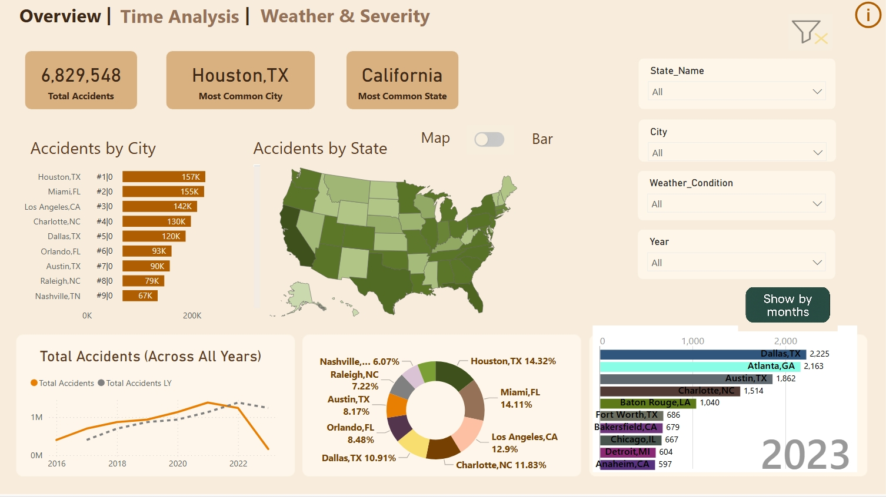

# Traffic Accidents Analysis with Python and Power BI

## 🧠 Project Overview
This project focuses on analyzing traffic accidents in the U.S. using a public dataset. The workflow involves:
- Data cleaning and processing with Python (Pandas, Matplotlib, Seaborn)
- Exporting a cleaned dataset
- Creating a dynamic dashboard in Power BI to explore trends, severity, and weather conditions

## 📊 Dashboard Highlights
The Power BI report includes:
- Total number of accidents by state
- Severity distribution
- Weather conditions during accidents
- Time analysis: accidents by hour, day, and month

## 🧰 Tools & Technologies
- Python (Pandas, Matplotlib, Seaborn)
- Jupyter Notebook
- Power BI
- Git & GitHub

## 📁 Folder Structure
- `data/`: original raw dataset (link to Kaggle)
- `notebooks/`: Python analysis and preprocessing
- `processed/`: cleaned data ready for visualization
- `dashboard/`: Power BI file (`.pbix`)

## 📥 Dataset Source
You can download the dataset from [Kaggle - US Accidents (Sobhan Moosavi)](https://www.kaggle.com/datasets/sobhanmoosavi/us-accidents).

## 🚀 How to Use
1. Clone the repo.
2. Run `accident_analysis.ipynb` in Jupyter to process the data.
3. Open the Power BI file (`accident_dashboard.pbix`) to explore the visualizations.

## 📷 Screenshots
# Traffic Accident Analysis Dashboard

> 🎯 An interactive dashboard that analyzes traffic accidents to help identify high-risk locations and conditions.

## 📊 Preview

## 📬 Contact
Created by Annie Abreu – [annie@datannie.com] – feel free to reach out!

## 📥 Dataset Source

This project uses the [US Accidents (Kaggle)](https://www.kaggle.com/datasets/sobhanmoosavi/us-accidents) dataset.  
To run the notebook, download `US_Accidents.csv` and place it in the `/data` folder.

